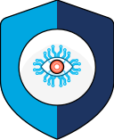

# Aegis

keep your secrets… secret

## Aegis Init Container

**Init Container** (`aegis-init-container`) will be injected to the pods as an
[init container][init-container].

**Init Container** periodically polls **Aegis Safe** until the secret associated 
with its workload is created. Once the secret is created, **Init Container** 
exits with a success status code. 

[Check out Aegis’ README][aegis-readme] for more information about the project,
high level design, contributing guidelines, and code of conduct.

[aegis]: https://github.com/zerotohero-dev/aegis "Aegis"
[aegis-readme]: https://github.com/zerotohero-dev/aegis/blob/main/README.md "Aegis README"
[init-container]: https://kubernetes.io/docs/concepts/workloads/pods/init-containers/ "Init Containers"

## Links

* **Homepage**: <https://aegis.ist>
* **Documentation**: <https://aegis.ist/docs/>
* **Changelog**: <https://aegis.ist/changelog/>
* **Community**: [Join Aegis’ Slack Workspace][slack-invite]
* **Contact**: <https://aegis.ist/contact/>
* **Media Kit**: <https://aegist.ist/media/>

[slack-invite]: https://join.slack.com/t/aegis-6n41813/shared_invite/zt-1myzqdi6t-jTvuRd1zDLbHX0gN8VkCqg "Join aegis.slack.com"
